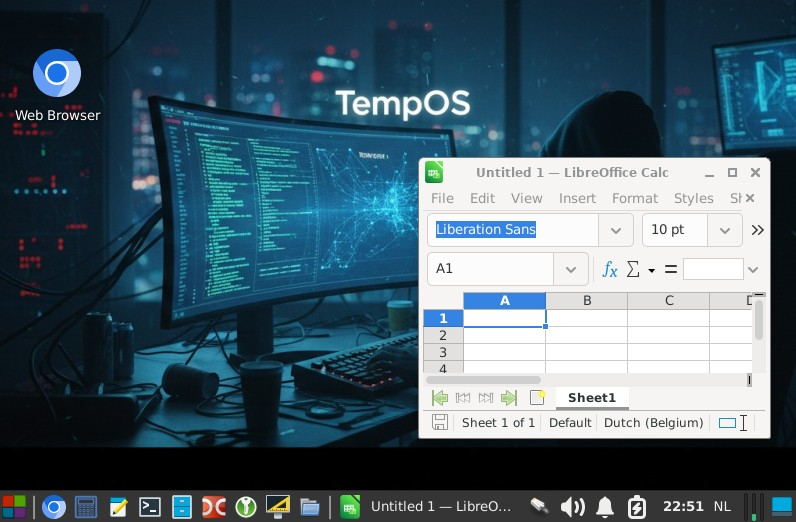

# TempOS

**TempOS** is a Debian-based graphical desktop live environment for USB drives designed for temporary, disposable sessions.

Use it as a quick desktop, rescue session or a classroom OS where experiments can be conducted without altering, degrading, or bloating the operating system for subsequent sessions.


---

## Features

- **Modern Base:** Built on Debian 13 with the latest version of Chromium.
- **Low Hardware Requirements:** Runs on older computers (15+ years) requiring only a 64-bit CPU and 2 GB of RAM.
- **Lightweight:** Uses under 1 GB of RAM when fully booted into the desktop.
- **Non-Destructive:** Does not touch internal drives; runs entirely without an internal HDD or SSD.
- **Read-Only Root:** Immutable system with support for mapping persistent directories.
- **Customizable Branding:** Easily rebrandable (includes a `CoderDojo` profile tailored for education with Scratch, micro:bit, Python, etc.).
- **Dual Boot Support:** Supports both Legacy (BIOS) and UEFI boot modes.
- **Network Ready:** Preconfigured Wi-Fi credentials and automatic captive portal sign-in (supports multiple portal types).
- **Kiosk/Classroom Friendly:** No login prompts, no sleep mode, no lock timeouts, and no screensavers.
- **Hardware & Web APIs:** WebUSB and WebSerial compatible; Bluetooth enabled.
- **RAM Disk Storage:** 2 GB volatile RAM disk for session data (app settings, documents, downloads, etc.).
- **RAM Compression:** RAM compression enabled to optimize low-memory situations.
- **Legacy Driver Support:** Broad driver support for older hardware.
- **Diagnostics:** Includes Memtest86.
- **Copy to RAM:** Boot option to load the entire OS into memory, allowing the USB drive to be safely removed (requires more RAM).
- **USB Cloning Tool:** Built-in installer to clone the OS to other USB drives.
- **Internal Installation:** Option to install directly to an internal drive.
- **Controlled Updates:** Online updates supported (manual trigger, never automatic).
- **Persistent Folders:** Selectable folders (e.g., `Downloads`, `Documents`) can be mapped directly to the USB drive.
- **Portable Applications:** Place standalone portable apps in an `AppsExt` folder on the USB drive to automatically expose them to the OS.

---

## Project Structure

```text
├── base/               # Standard TempOS configuration and assets (cannot be built on its own)
├── TempOS/             # Empty profile directory used to build the standard base image
├── CoderDojo/          # Customized, rebranded profile layered over base
├── build/              # Output directory with merged configs and build artifacts
│   ├── TempOS/
│   └── CoderDojo/
├── ventoy/             # Ventoy configuration and theme files copied to the USB drive
└── vm-build/           # VM setup and qcow2 image
```

---

## Installation

### Manual Installation (Ventoy)

1. Install Ventoy to the USB drive and label the partition `TempOS`:
   ```bash
   ./Ventoy2Disk.sh -I /dev/sdx -L TempOS
   ```
   *(Replace `/dev/sdx` with your target USB drive).*

2. Copy the `ventoy/` directory to the root of the USB drive.
3. Create a branding folder at the root of the USB drive matching your profile name (e.g., `TempOS` or `CoderDojo`).
4. Inside this branding folder, create an `AppsExt/` directory for portable applications.
5. Copy the `.iso` and `.iso.sha256` release files into the branding folder.
6. Edit `ventoy/ventoy.json` to configure the default `.iso` image to boot.

#### Example USB Drive Layout

```text
/CoderDojo/
├── AppsExt/
├── CoderDojo-13.6.0.iso
└── CoderDojo-13.6.0.iso.sha256
/ventoy/
├── select_c.png
├── tempos800x600.png
├── tempostheme.txt
├── unicode.pf2
└── ventoy.json
```

### Installation via Installer Image

1. Download the TempOS (or branded) `.iso` file and write it to a USB drive:
   ```bash
   dd if=CoderDojo-13.6.0.iso of=/dev/sdx bs=4M status=progress oflag=sync
   ```
   *(Replace `/dev/sdx` with your target USB drive).*

2. Boot from the USB drive. An installation wizard will appear on startup.
3. Follow the wizard to install TempOS onto a secondary USB drive or an internal drive. *(Note: You cannot install directly onto the live drive you booted from).*

---

## Configuration

After booting into TempOS:
1. Open the application menu (**Start**).
2. Navigate to **Development** &rarr; **TempOS**.
3. Use the management utility to configure settings or perform installations.

---

## Wi-Fi Captive Portal Support

TempOS automatically detects and attempts authentication on supported captive portals.

### Detection Command
```bash
curl -I -m 3 http://google.be
```

### Supported Portal Types

- **HPE:**
  ```http
  HTTP/1.1 302 Captive Portal
  Location: https://securelogin.hpe.com/swarm.cgi?opcode=cp_generate&orig_url=http%3a%2f%2fgoogle%2ebe%2f
  ```
- **Ruckus:**
  ```http
  HTTP/1.1 302 Found
  Location: http://10.x.x.x:9997/user/guest_tou.asp?origurl=http%3a%2f%2fgoogle%2ebe%2f&langname=nl_NL&logo=%2fwritable%2fdata%2fwsgclient%2flogo_1
  ```

---

## Building from Source

### Initial Environment Setup

Building is performed inside a QEMU VM running a Debian 13 prebuild image:

1. Install QEMU and KVM dependencies:
   ```bash
   sudo apt update
   sudo apt install qemu-system-x86 qemu-utils
   ```
2. Download a Debian 13 image (e.g., `debian-13-nocloud-amd64-*.qcow2`) and place it at:
   ```text
   ./vm-build/vm-build.qcow2
   ```
3. Expand the disk image to provide sufficient build space:
   ```bash
   qemu-img resize ./vm-build/vm-build.qcow2 +50G
   ```
4. Start the VM:
   ```bash
   ./startvm.sh
   ```
   - If prompted for a timezone index, enter `378`.
   - When prompted for a root password, set it to `root`.
5. Log in as `root` / `root` inside the VM console.
6. Mount the host project directory and initialize the build environment:
   ```bash
   mkdir -p /mnt/project
   mount -t 9p -o trans=virtio,version=9p2000.L hostshare /mnt/project
   bash /mnt/project/vm-build/initvm.sh
   ```

### Building an Image

1. Start the VM with `./startvm.sh` if it is not already running.
2. Run the build script with the desired branding profile:
   ```bash
   ./build.sh TempOS
   # Or for the CoderDojo flavor:
   ./build.sh CoderDojo
   ```

---

## Changelog

Version numbers follow the upstream Debian base release with an added suffix for internal TempOS releases.

### 13.6.0
- Added support for additional Wi-Fi captive portals and logging portal types.
- Added QWERTY / AZERTY keyboard layout selector.
- Added online update check on startup.
- Added interactive installation wizard when booted directly from `.iso`.
- Added `d2bench` benchmarking tool.

### 13.5.0
- Changed internet wait behavior to wait indefinitely unless dismissed by user.
- Replaced timeout setting with an explicit "Offline Mode" toggle to bypass connectivity checks.

### 13.4.0
- Set default external display action to mirror automatically without a prompt dialog (prevents disruptions during HDMI handshakes).
- Enabled software OpenGL emulation in Chromium when blacklisted GPU drivers are detected.
- Removed legacy `xserver-xorg-video-intel` driver in favor of the kernel modesetting driver.
- Added `lazpaint-qt5`.

### 13.3.1
- Configured Chromium to always prompt for download destination folder.
- Added startup sequence logging to `start_log.txt`.
- Added option to cancel automatic dismissal of the startup screen.
- Added automatic cleanup of old OS images during updates.
- Improved update logs and update UI interface.
- Added reboot button following updates.